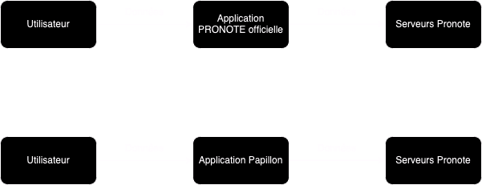

# 📖 Politique de confidentialité


Ce service peut être amené à collecter certaines données personnelles de ses utilisateurs pour le fonctionnement du service.\
**Lors de l'utilisation de l'application, aucune donnée n'est conservée ni ne transite sur des serveurs externes au terminal sur lequel l'application est installée.**


## 1. - Services concernés 

Les services concernés par cette politique de confidentialité incluent, mais ne se limitent pas à :

* Le site web de présentation
  * [https://papillon.bzh](https://papillon.bzh)
* Les différentes pages de documentation
  * [https://docs.papillon.bzh](https://docs.papillon.bzh)
  * [https://developers.papillon.bzh](https://developers.papillon.bzh)
* Les pages de communication
  * [https://blog.papillon.bzh](https://blog.papillon.bzh)
* L'application mobile Papillon
  * (code source disponible sur GitHub à l'adresse [https://github.com/PapillonApp/papillon](https://github.com/PapillonApp/papillon))

Ces services peuvent recueillir des données personnelles spécifiques à leurs utilisateurs comme décrit dans la suite de ce document.

## 2. - Quelles données sont collectées ? 

### 2.1 - Données collectées 

Les données personnelles peuvent être collectées via différentes méthodes et pour diverses raisons au sein de notre service, comme illustré ci-dessous:



*   **Vos données d’identification à votre service scolaire**

    > Identifiants de connexion au service scolaire, URL de l'établissement et académie correspondante _(le cas échéant)_


Ces données d'identification ne sont pas stockées en dehors de votre appareil et sont utilisées uniquement pour vous identifier, conformément à ce qui est indiqué à [https://safety.getpapillon.xyz/usage/data](https://safety.getpapillon.xyz/usage/data)


*   **Vos données scolaires**

    > Emploi du temps, Travail à faire, Notes, Compétences, Actualités de l'établissement, Conversations et Événements de vie scolaire


Ces données sont renvoyées par les services de vie scolaire correspondants. Ces données ne quitteront jamais votre appareil et seuls vous y avez accès conformément aux mention indiquées sur [https://safety.getpapillon.xyz/usage/data](https://safety.getpapillon.xyz/usage/data)




Nous tenons à informer nos utilisateurs que le site web de présentation [https://getpapillon.xyz](https://getpapillon.xyz) respecte pleinement la vie privée de chacun. Seule votre adresse ip est enregistrée lors de votre visite sur ce site, nous n'utilisons aucun outil d'analyse pour suivre le comportement des visiteurs. Notre engagement envers la protection de votre vie privée est total et transparent.




L'ensemble des documentations sont hébergées sur le service en ligne GitBook.com. Sa [**politique de confidentialité**](https://policies.gitbook.com/privacy-and-security/statement/cookies) s'applique.


Les pages de documentation ([docs.getpapillon.xyz](https://docs.getpapillon.xyz), [brand.getpapillon.xyz](https://brand.getpapillon.xyz), etc.) ne collectent pas activement des données personnelles. Toutefois, des données anonymes pourraient être utilisées pour mesurer l'engagement et l'utilisation des ressources fournies, afin d'améliorer continuellement le contenu. Cela inclut:

* Le nombre de visites par page
* La durée moyenne de la visite
* Le type de dispositif utilisé pour accéder



Chacune de ces méthodes a été mise en place dans le respect total de votre vie privée, en veillant à ce que seules les données nécessaires soient collectées pour le fonctionnement optimal de nos services.

#### 2.1.1 Logs et crash reports 


Conformément à notre engagement envers la protection de la vie privée, **aucun log d'activité ou de données personnelles n'est enregistré sur nos services et applications**. Cette politique garantit une confidentialité totale de l'utilisation de nos outils par les utilisateurs.


Bien que nous ne collectons ni ne stockons de données personnelles dans nos systèmes, des rapports d'erreurs ou _crash reports_ peuvent être remontés par le système d'exploitation. Ces rapports contiennent uniquement des informations anonymisées concernant l'état du système au moment de l'erreur. Ces informations sont utilisées exclusivement pour l'amélioration de nos services et ne sont en aucun cas liées à votre identité ou à vos données personnelles.

Pour garantir et respecter la vie privée de nos utilisateurs, aucune information liée à l'identité de l'utilisateur ni aucune donnée scolaire (telles que les notes, l'emploi du temps, etc.) n'est collectée ou stockée par nos systèmes. Notre engagement dans la protection de votre vie privée s'étend à toutes les fonctionnalités de notre application, assurant ainsi une expérience sécurisée et confidentielle.

### 2.2 - Données liées à l'identité

Nous tenons à souligner que **nous ne conservons aucune donnée liée à l'identité de nos utilisateurs**. Cette mesure s'inscrit dans notre politique stricte de protection de la vie privée, garantissant ainsi que toutes les interactions avec nos services préservent l'anonymat et la confidentialité.

### 2.3 - Accès extérieur aux données 

Aucune personne ou logiciel automatisé n’utilise, ne traite ou ne collecte vos données personnelles.

### 2.4 - Suppression des données

La suppression de l'application ou la déconnexion entraîne immédiatement la suppression de l'intégralité des données stockées sur votre appareil. Nous ne conservons aucune copie de vos données après la suppression de l'application, assurant ainsi une maîtrise totale de vos informations personnelles.

### 2.5 - RGPD
Conformément au Règlement Général sur la Protection des Données, et notamment la loi n° 2018-493 du 20 juin 2018 relative à la protection des données personnelles, vous disposez d'un droit de rectification, de suppression et de consultation concernant vos données personnelles collectées lors de votre visite sur le site https://papillon.bzh. Pour toute demande, adressez un courriel au responsable de traitement via l'adresse : [contact@vincelinise.com](mailto:contact@vincelinise.com).

### 2.6 - Comparaison avec l'application PRONOTE officielle
Voici un schéma comparant le fonctionnement de Papillon et de l'application PRONOTE officielle, on voit ici que son fonctionnement est proche de celui de la version officielle ; en effet, Papillon ne sert que d'intermédiaire entre l'utilisateur et les serveurs officiels de PRONOTE, ne faisant que transmettre des données entre les deux, sans intermédiaire.

## 3. - Client mobile Papillon 

Le client mobile **Papillon** est un logiciel **open source**, **gratuit**, **libre** et à but **non lucratif**. Conçu avec l'objectif principal de fournir un accès simplifié aux données essentielles des services scolaires, il agit comme une interface entre l'utilisateur et les nombreuses données transmises par des librairies tierces. Les mainteneurs de l'application Papillon s'engagent à maintenir une totale transparence sur ses méthodes de fonctionnement et sur l'utilisation des données. En se basant sur des principes de développement collaboratifs, Papillon invite la communauté à participer à son évolution en contribuant au code, en proposant des améliorations ou en signalant des bugs, pour s'assurer que le logiciel reste à jour et réponde au mieux aux besoins de ses utilisateurs.

### 3.1. - Sécurité des données

La sécurité et la transparence dans le traitement des données des utilisateurs sont d'une importance primordiale pour nous. Nous nous engageons fermement à adopter des mesures de sécurité robustes pour protéger les données contre les accès non autorisés, les modifications, les divulgations ou les destructions inappropriées. De plus, nous nous assurons de communiquer de manière transparente sur les pratiques de collecte, d'utilisation et de partage des données, permettant ainsi à nos utilisateurs de comprendre clairement comment leurs informations sont gérées.

### 3.2. - Récupération des données et services open-source

L'approche open source de **Papillon** est au cœur de notre stratégie de sécurisation des données. En rendant notre code accessible à tous, nous permettons à une communauté mondiale de contributeurs de le vérifier, de l'améliorer et d'identifier d'éventuelles failles de sécurité. Cette collaboration continue garantit que l'application ne se contente pas de respecter les normes actuelles de sécurité, mais qu'elle est également constamment mise à jour grâce aux contributions régulières de la communauté. Cette démarche participative assure une transparence totale et contribue à renforcer la confiance de nos utilisateurs dans la protection de leurs données.

### 3.3. - Accès aux données via API publiques

Notre politique d’accès aux données est strictement limitée à celles mises à disposition par les API publiques des services scolaires, de la même manière que l’application officielle de ces services. **Papillon** s'engage à ne recourir à aucun moyen détourné pour accéder aux données de ces services. Cette approche garantit que l'utilisation des données reste conforme à la politique de confidentialité des services scolaires concernés, tout en respectant les droits et la vie privée de nos utilisateurs.

## 4. - Modification de la politique de confidentialité 

### 4.1 - Engagement concernant l'avenir du projet 

Nous nous engageons à ne pas collecter de données à l'avenir, afin de préserver la confidentialité et l'intégrité des informations de nos utilisateurs. Cet engagement reflète notre volonté de construire une relation de confiance durable avec notre communauté.

### 4.2 Mise à jour de la politique de confidentialité

Papillon se réserve le droit de mettre à jour cette politique de confidentialité à tout moment. Dans ce cas, l'utilisateur peut être amené à être notifié.

## 5. - En cas de problème 

En cas de problème avec l'application ou son traitement des données, merci de nous contacter à l'adresse suivante : [contact@vincelinise.com](mailto:contact@vincelinise.com).
